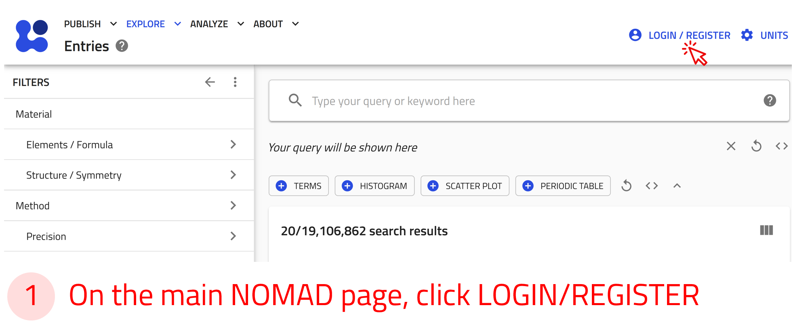
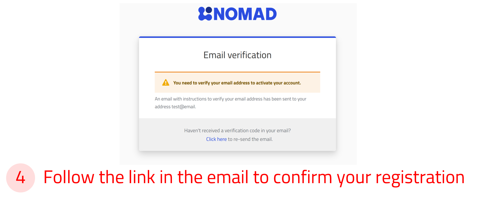
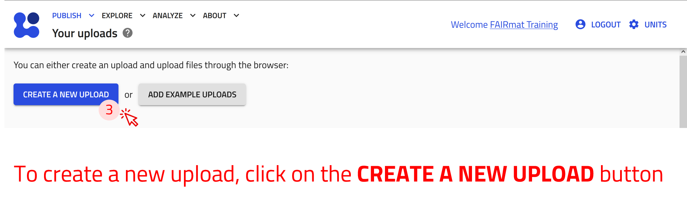
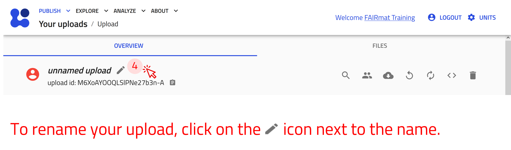
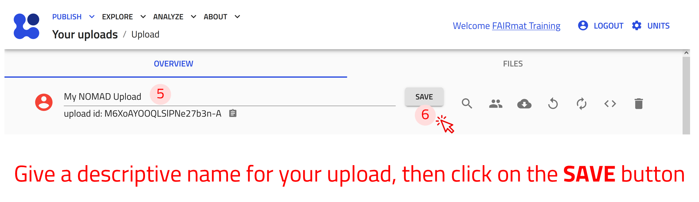

# Instructions for the FAIRmat Event Request Form

This page provides instructions for submitting an event participation request in the [FAIRmat Oasis](https://fairmat-oasis.physik.hu-berlin.de/nomad-oasis/gui). The collected information helps FAIRmat keep an overview of the events the team attends, the topics they cover, and the associated costs.

## Create a NOMAD user account

A NOMAD user account is required to access and use NOMAD services, including data management, collaboration, publishing, and analysis features across the NOMAD ecosystem. Publicly available data on NOMAD can be explored without an account. Creating an account is free and only takes a few minutes.

If you already have a NOMAD account, you can use the same account credentials to access the Outreach NOMAD Oasis. There is no need to create a separate account.

!!! warning "Attention"
    Access to the Outreach NOMAD Oasis is restricted to authorized users. The official email addresses of FAIRmat PIs have already been whitelisted. If you create your NOMAD account using your official FAIRmat email address, you should be able to access the onboarding Oasis without additional steps.

    If you have questions about which email address has been whitelisted, experience access issues, or would like to use a different email address, please [contact the FAIRmat team](mailto:fairmat@physik.hu-berlin.de).

**Use the arrow buttons ⬅️➡️ below to slide through the steps and create a NOMAD account.**

    
←

    
    
    
    
    
→

!!! tip "Login via Helmholtz AAI"
    You can also sign in to NOMAD using your university or research institute credentials, or with social accounts such as GitHub, ORCID, or Google through the Helmholtz AAI.
    For more information, see [NOMAD documentation](https://nomad-lab.eu/prod/v1/docs/tutorial/overview.html#login-options-via-helmholtz-aai){:target="_blank" rel="noopener"}

---

## Create new upload

In NOMAD, uploads are used to organize and manage related files and entries. During the FAIRmat PI onboarding process, you will create an upload that contains your onboarding form and related information.

For more information about NOMAD uploads and entries, see [The key elements in NOMAD](https://fairmat-nfdi.github.io/nomad-docs/tutorial/upload_publish.html#the-key-elements-in-nomad){:target="_blank" rel="noopener"}

The uploads exist in the *Your uploads* page. Here you can view a list of all your uploads with their relevant information. You can also create new uploads or add an example upload prepared by others.

**Use the arrow buttons ⬅️➡️ below to follow the steps for creating your first upload.**

    
←

    
    
    
    
    
→

---

## Create an event request entry

!!! warning "TODO — work in progress"
    This section is not finished yet. The steps and screenshots still need to be added.

The FAIRmat Event Request Form is provided as an ELN entry within NOMAD. NOMAD ELN entries provide structured, form-based interfaces for collecting and managing information.

In this step, you will create a new entry based on the FAIRmat event request schema.

**Use the arrow buttons ⬅️➡️ below to follow the steps for creating the entry from the built-in schema.**

    
←

    
    
    
    
    
→

---

## Fill in the request

!!! warning "TODO — work in progress"
    This section is not finished yet. The steps and screenshots still need to be added.

The entry opens with your applicant and participant information, followed by the event details and the expected expenses.

!!! tip "Submitter and participant"
    The **Submitter** is filled in automatically from your logged-in account. The **Participant: Same as submitter** box is checked by default, so when the request is for yourself you can leave it as is. If you are filling in the form for someone else, uncheck the box and enter that person's name and e-mail.

**Use the arrow buttons ⬅️➡️ below to follow the steps for filling in your request.**

    
←

    
    
    
    
→

The **expected expenses** subsection can be added more than once — add one entry per cost category (transportation, accommodation, conference, or other) and pick the category from the dropdown.

!!! tip "Provide as much detail as you can"
    For cost-related fields, include details such as the number of nights or the method of transport, and add a justification where the form asks for one. This helps the review go quickly.

---

## What happens after you submit

Once your request is complete, it is reviewed by **Areas F and G**. After approval, you can proceed with the next steps, for example the official [Humboldt University travel request](../travel_information/travel_information.md) for an event you will attend.

!!! warning "Please wait for confirmation"
    Do **not** book or advertise anything until the event and its details have been confirmed.

For a detailed description of every form field, see the [Reference](../reference/references.md).
